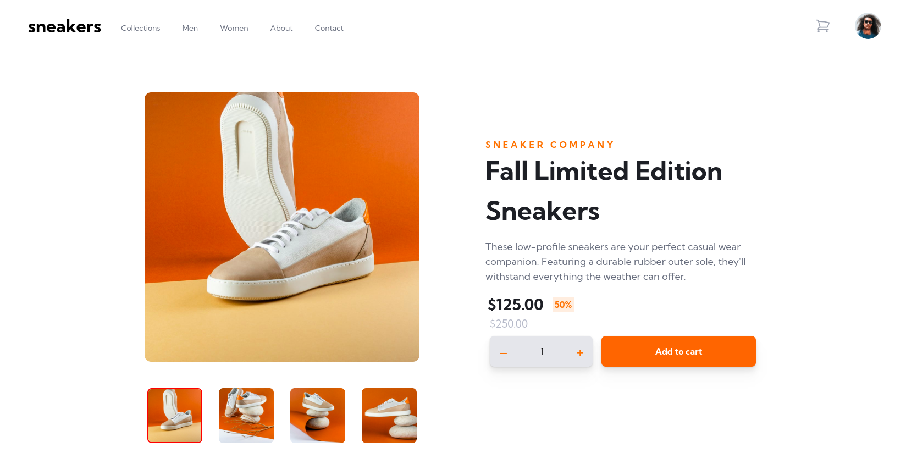

# Frontend Mentor - E-commerce product page solution

This is a solution to the [E-commerce product page challenge on Frontend Mentor](https://www.frontendmentor.io/challenges/ecommerce-product-page-UPsZ9MJp6). Frontend Mentor challenges help you improve your coding skills by building realistic projects.

## Table of contents

- [Overview](#overview)
  - [The challenge](#the-challenge)
  - [Screenshot](#screenshot)
  - [Links](#links)
- [My process](#my-process)
  - [Built with](#built-with)
  - [What I learned](#what-i-learned)
  - [Useful resources](#useful-resources)
- [Author](#author)

 
## Overview

### The challenge

Users should be able to:

- View the optimal layout for the site depending on their device's screen size
- See hover states for all interactive elements on the page
- Open a lightbox gallery by clicking on the large product image
- Switch the large product image by clicking on the small thumbnail images
- Add items to the cart
- View the cart and remove items from it

### Screenshot

### Links

- Solution URL: [Github](https://github.com/DhairyaSehgal07/E-com-product-page)
- Live Site URL: [E-com-product-page07](https://e-com-product-page07.netlify.app/)

## My process

### Built with

- Semantic HTML5 markup
- CSS custom properties
- Flexbox
- Mobile-first workflow
- [React](https://reactjs.org/) - JS library
- [Framer-motion](https://www.framer.com/motion/examples/?utm_source=google&utm_medium=adwords&utm_campaign=TW-WW-All-GS-UA-Traffic-20190326-Brand.Bmm_&gad=1&gclid=CjwKCAjwwb6lBhBJEiwAbuVUSs-PU-SL_Gj9tGYWRIRnBm4ekyttM7KOtnhGsr9pfpgkDRD3EmkMNxoCq-wQAvD_BwE) - JS library
- [Tailwind css](https://tailwindcss.com/) - For styles

### What I learned

This project provided me with valuable insights into implementing cart functionality in React. I successfully learned how to enable users to add and delete items from the cart, enhancing the overall user experience. Furthermore, I expanded my skill set by mastering the creation of an image carousel within the project. Additionally, I gained proficiency in incorporating animations through the use of Framer Motion library. Overall, this project proved to be an exceptionally enriching learning experience, equipping me with practical knowledge and skills in React development.

### Useful resources

- [React dev docs](https://react.dev/) - This helped me to gain an understanding of react hooks
- [Tailwind css docs](https://tailwindcss.com/) - This is an amazing article which helped me find the suitable styles for my components.It also helped me with the syntax of tailwind css
- [Framer motion docs](https://www.framer.com/motion/examples/?utm_source=google&utm_medium=adwords&utm_campaign=TW-WW-All-GS-UA-Traffic-20190326-Brand.Bmm_&gad=1&gclid=CjwKCAjwwb6lBhBJEiwAbuVUSs-PU-SL_Gj9tGYWRIRnBm4ekyttM7KOtnhGsr9pfpgkDRD3EmkMNxoCq-wQAvD_BwE) - This is a very helpful resource , if you want to learn about animations. The documentation is very beginner friendly.

## Author

- Website - [Dhairya Sehgal](https://dhairya-sehgal-portfolio.netlify.app/)
- Frontend Mentor - [@DhairyaSehgal07](https://www.frontendmentor.io/profile/DhairyaSehgal07)

